---
# 以 default 主题作为中性底座；具体层级由本文件的 UnoCSS 工具类控制，减少主题切换带来的版式漂移。
theme: default
title: 基于图像识别的数字实验芯片型号自动识别技术研究
info: |
  毕业设计答辩演示稿。
# 固定画布内边距，保证长中文标题和后续图表占位都落在 16:9 导出的安全区域内。
class: px-16 py-10
# 答辩场景以信息推进为主，统一转场可以避免技术章节之间出现多余的视觉噪声。
transition: slide-left
# 临场批注默认不写回文件，避免排练标记意外进入导出的评审版本。
drawings:
  persist: false
# 正文混用 Markdown 与 HTML，是为了让图表占位后续能直接替换为可控的组件或图片。
mdc: true
---

<!-- 封面使用显式字号和行高，是为了让长中文题目在浏览器预览、PDF 和 PPTX 导出中保持可预测换行。 -->

  
毕业设计答辩

  <h1 class="text-[54px] leading-[1.12] font-semibold text-slate-900 max-w-5xl">
    基于图像识别的数字实验芯片型号自动识别技术研究
  </h1>
  
OpenCV 纯视觉定位 · 本地轻量级 OCR · 离线实时识别

  

    
答辩人：陈智文

    
学号：23223976

    
专业：电气工程及其自动化

  

  

    
指导教师：董海波 副教授

    
电气工程学院 · 中国矿业大学

    
2026 年 6 月

  

---
title: 目录
---

<!-- 目录采用五列提纲，是为了在单页 16:9 画布内完整露出全部章节，避免纵向目录在预览时裁掉最后一节。 -->
<h1 class="text-[42px] leading-tight font-semibold text-slate-900">汇报目录</h1>

  

    
01

    
研究背景 与意义

    
现场痛点与系统目标

  

  

    
02

    
方案探索 技术选型

    
YOLO 到 OpenCV + OCR

  

  

    
03

    
系统设计 核心实现

    
抽帧、定位、缓存、匹配

  

  

    
04

    
实验结果 分析

    
效果、耗时、失败案例

  

  

    
05

    
总结 展望

    
成果闭环与后续优化

  

  

    
主线

    
看见芯片，输出标准型号

  

  

    <a href="#" @click.prevent="$nav.go(16)" class="text-[21px] font-semibold text-sky-700 underline underline-offset-4">
      系统流程总览
    </a>
  

---
title: 研究背景
---

<!-- 正文页统一使用可控两栏网格：左侧保持简短阅读路径，右侧预留稳定的后续图表替换区域。 -->

研究背景

<h1 class="mt-3 text-[40px] leading-tight font-semibold text-slate-900">人工分拣的瓶颈来自小字符与复杂现场</h1>

- 芯片种类多、周转快，人工核对耗时且容易出错。
- 表面字符小、字迹细暗，光照不均和反光会进一步放大识别难度。
- 云端 OCR 有延迟与隐私顾虑，通用模型难适配实验室非标准场景。

目标是构建本地运行、低延迟、易部署的自动识别系统。

  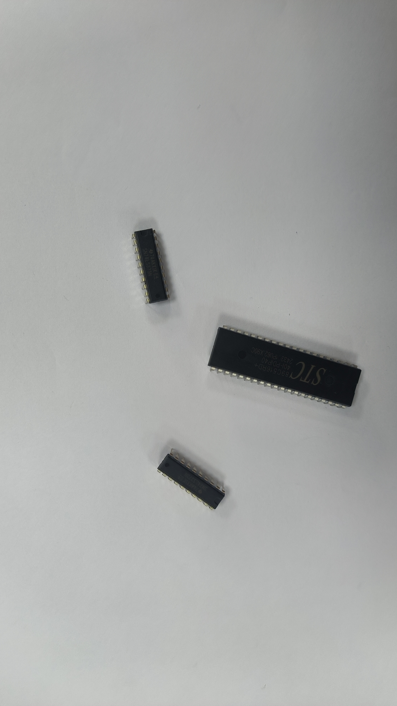

---
title: 方案探索
---

方案探索

<!-- 方案页保留到漏检补充页的跳转，是为了答辩追问时能快速展开失败样例。 -->

  <h1 class="text-[40px] leading-tight font-semibold text-slate-900">YOLO 小样本方案难以稳定落地</h1>
  <button class="mt-2 shrink-0 border border-rose-200 bg-white/70 px-4 py-2 text-[16px] font-medium text-rose-700 hover:bg-rose-50" @click="$nav.go(17)">查看漏检问题</button>

### 早期尝试

- 使用 YOLO-obb 识别旋转芯片目标。
- 直接输出芯片区域与角度信息。

### 转向原因

- 样本规模不足，复杂光照和陌生背景下漏检明显。
- 核显平台单帧推理超过 500 ms，叠加 OCR 后实时性不足。

<!-- 表格直接由浏览器渲染，是为了避免 Word 截图在导出时出现压缩、锯齿和背景残留。 -->

  

    模型在不同分辨率输入下的表现，s是检出率，t是耗时（单位：毫秒）
  

  <table class="three-line-table">
  <thead>
    <tr>
      <th>分辨率</th>
      <th>图 1</th>
      <th>图 2</th>
      <th>图 3</th>
    </tr>
  </thead>
  <tbody>
    <tr>
      <td class="resolution-cell">2560×1440</td>
      <td>s: 2/3t: 544.4</td>
      <td>s: 2/4t: 569.6</td>
      <td>s: 2/2t: 568.8</td>
    </tr>
    <tr>
      <td class="resolution-cell">1920×1080</td>
      <td>s: 2/3t: 470.8</td>
      <td>s: 3/4t: 545.2</td>
      <td>s: 2/2t: 481.1</td>
    </tr>
    <tr>
      <td class="resolution-cell">1280×720</td>
      <td>s: 2/3t: 412.8</td>
      <td>s: 2/4t: 400.2</td>
      <td>s: 2/2t: 420.9</td>
    </tr>
  </tbody>
</table>

---
title: 技术选型
---

技术选型

<h1 class="mt-3 text-[40px] leading-tight font-semibold text-slate-900">轻量 OCR 与 OpenVINO 兼顾本地部署和低延迟</h1>

- 定位采用 OpenCV 纯视觉流程，避免训练与模型部署开销。
- OCR 采用 PP-OCRv5 mobile，满足本地轻量推理需求。
- RapidOCR 转 ONNX，OpenVINO 针对 Intel CPU 做底层优化。

  

    
470

    
ms · OpenVINO

  

  

    
1345

    
ms · ONNX Runtime

  

  

    
2039

    
ms · PyTorch

  

<!-- 模型配置表用 HTML 重建，是为了让长模型名在导出时保持矢量文字与可控换行。 -->

  

  

    模型结构概览
  

  <table class="model-config-table">
    <thead>
      <tr>
        <th>模型名</th>
        <th>算法</th>
        <th>Backbone</th>
        <th>Neck</th>
        <th>Head</th>
      </tr>
    </thead>
    <tbody>
      <tr>
        <td class="model-name-cell">PP-OCRv5_mobile_det</td>
        <td>DB</td>
        <td>PP-LCNetV3</td>
        <td>RSEFPN</td>
        <td>DBHead</td>
      </tr>
      <tr>
        <td class="model-name-cell">PP-OCRv5_mobile_rec</td>
        <td>SVTR_LCNet</td>
        <td>PP-LCNetV3</td>
        <td>/</td>
        <td class="head-cell">CTCHead +NRTRHead</td>
      </tr>
    </tbody>
  </table>
  

---
title: 系统设计
---

系统设计

<h1 class="mt-3 text-[40px] leading-tight font-semibold text-slate-900">系统被拆成采集、定位、识别、规则匹配四段</h1>

<!-- 四张职责卡片替代架构占位图，是为了和目录中的系统流程图形成互补：这里强调模块分工而不是完整流程。 -->

  

    
采集

    
前端使用 Gradio 与浏览器摄像头抽帧，控制输入频率。

  

  

    
定位

    
OpenCV 负责多芯片定位、过滤、排序与透视裁剪。

  

  

    
识别

    
FastAPI 推理服务常驻内存，减少重复加载模型成本。

  

  

    
规则匹配

    
规则库将 OCR 原始文本映射为标准芯片型号。

  

---
title: 核心机制 01
---

核心机制 01

<h1 class="mt-3 text-[40px] leading-tight font-semibold text-slate-900">帧差计算可以减少推理次数</h1>

<!-- 正文改为三张卡片，是为了把“抽帧、判断、复用”三个动作拆开讲，流程图则留到补充页展开。 -->

  

    
关键帧抽取

    
浏览器每 1 秒抽取关键帧，避免持续视频流传输。

  

  

    
变化判断

    
后端计算平均亮度差和显著变化像素比例，判断画面是否稳定。

  

  

    
结果复用

    
画面稳定且上帧结果已匹配时，直接复用历史识别结果。

  

  

    连续视频被转换为按需触发的识别请求，减少无效推理。
  

  <button class="shrink-0 border border-amber-200 bg-white/70 px-5 py-2.5 text-[17px] font-medium text-amber-700 hover:bg-amber-50" @click="$nav.go(18)">查看流程图</button>

---
title: 核心机制 02
---

核心机制 02

<!-- 卡片页保留流程图入口，是为了先讲定位分割的四个判断动作，再按需展开完整流程。 -->

  <h1 class="text-[40px] leading-tight font-semibold text-slate-900">多路掩码比单一阈值更适合实验室光照</h1>
  <button class="mt-2 shrink-0 border border-amber-200 bg-white/70 px-5 py-2.5 text-[17px] font-medium text-amber-700 hover:bg-amber-50" @click="$nav.go(19)">查看流程图</button>

  

    
增强边界

    
灰度化与对比度增强提升芯片边界可见性。

  

  

    
生成候选

    
暗区掩码与边缘结构掩码共同生成候选区域。

  

  

    
过滤轮廓

    
轮廓经过面积、长宽比、填充率和特征评分过滤。

  

  

    
裁剪输出

    
NMS 去重后排序，输出背景干净的标准化裁剪图。

  

---
title: 核心机制 03
---

核心机制 03

  <h1 class="mt-3 text-[40px] leading-tight font-semibold text-slate-900">缓存与多变体预处理共同降低排队延迟</h1>
  <button class="mt-2 shrink-0 border border-amber-200 bg-white/70 px-5 py-2.5 text-[17px] font-medium text-amber-700 hover:bg-amber-50" @click="$nav.go(20)">查看流程图</button>

- 单芯片缓存使用 IoU 与灰度指纹双重约束，避免位置未变时重复 OCR。
- 只对发生位移或识别失败的芯片重新推理。
- 预处理生成 original、upscaled、CLAHE、laser_dark、laser_bright、blackhat 等变体。
- 优先使用 laser_dark，失败后再自动回退。

  <figure class="w-[60%]">
    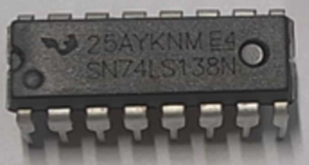
    <figcaption class="mt-2 text-center text-[15px] leading-snug text-slate-500">upscaled 变体示例</figcaption>
  </figure>
  <figure class="w-[60%]">
    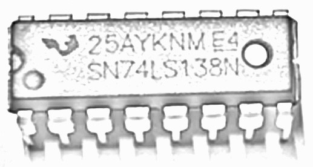
    <figcaption class="mt-2 text-center text-[15px] leading-snug text-slate-500">laser_dark 变体示例</figcaption>
  </figure>

---
title: 核心机制 04
---

核心机制 04

<h1 class="mt-3 text-[40px] leading-tight font-semibold text-slate-900">规则库把 OCR 文本收敛为标准型号</h1>

- OCR 原始结果常见字符缺失、空格干扰和 0/O、1/I 混淆。
- CSV 作为人工维护源，SQLite 作为运行时缓存。
- 正则清洗后按优先级匹配 74 系列、CD 系列等命名规律。
- 未匹配文本保留，便于后续人工补充规则。

  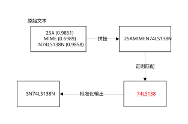

---
title: 实验结果
---

实验结果

  <h1 class="text-[40px] leading-tight font-semibold text-slate-900">多芯片场景下定位与识别达到可用水平</h1>
  <button class="mt-2 shrink-0 border border-amber-200 bg-white/70 px-5 py-2.5 text-[17px] font-medium text-amber-700 hover:bg-amber-50" @click="$nav.go(21)">查看示例</button>

<!-- 结果页改为三张卡片，是为了在图表示例页之外先并列呈现实验条件、速度和质量三个结论。 -->

  

    
测试环境

    
海康威视摄像头 2560 × 1440，Intel i5-12500H 核显。

  

  

    
分割耗时

    
单帧约 300-500 ms，且不随芯片数量线性增加。

  

  

    
文本质量

    
laser_dark 变体增强激光打标字符，提升 OCR 原始文本质量。

  

系统重点是在受限算力下稳定跑完整链路，而不是追求单模型极限精度。

---
title: 耗时分析
---

耗时分析

<h1 class="mt-3 text-[40px] leading-tight font-semibold text-slate-900">帧差与缓存显著压缩后端请求量</h1>

<!-- 左右容器对应“原因”和“效果”，是为了让耗时瓶颈与优化收益在同一视线上直接对照。 -->

  <section class="min-h-[365px] rounded-[6px] border border-slate-200 bg-white/70 p-5">
    
耗时来源

    

      

        
单帧处理

        
分割约 300 ms，OCR 推理约 450 ms。

      

      

        
积压风险

        
连续并发模式 10 秒内请求 9-11 次，易形成积压。

      

    

  </section>

  <section class="min-h-[365px] rounded-[6px] border border-slate-200 bg-white/70 p-5">
    
请求压缩效果

    

      

        
3-5

        
帧差 + 缓存请求

      

      

        
9-11

        
连续并发请求

      
      
    

  </section>

---
title: 局限分析
---

局限分析

<h1 class="mt-3 text-[40px] leading-tight font-semibold text-slate-900">主要失败来自几何边界与极端成像条件</h1>

<!-- 失败案例页用图片替代抽象列表，是为了让局限来源直接对应到可见现象。 -->

  

  <figure>
    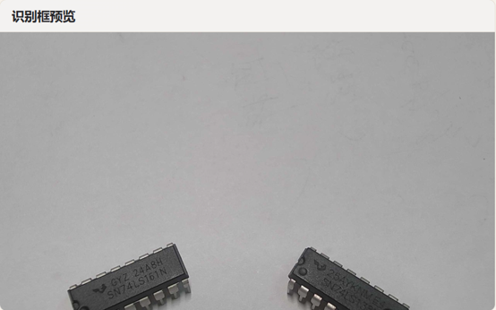
    <figcaption class="mt-1 text-center text-[14px] leading-snug text-slate-600">贴边芯片轮廓不完整，易被几何过滤剔除。</figcaption>
  </figure>
  <figure>
    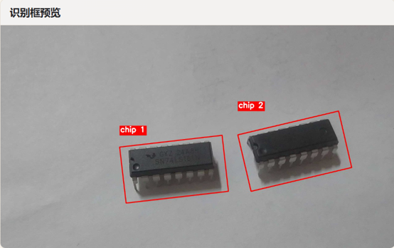
    <figcaption class="mt-1 text-center text-[14px] leading-snug text-slate-600">光照不足时字符对比度不足，OCR 特征难以提取。</figcaption>
  </figure>
  <figure>
    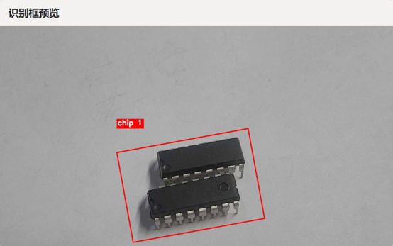
    <figcaption class="mt-1 text-center text-[14px] leading-snug text-slate-600">芯片距离过近时，形态学闭运算可能合并相邻目标。</figcaption>
  </figure>
  <figure>
    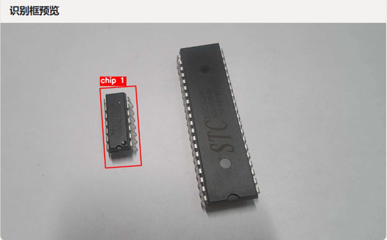
    <figcaption class="mt-1 text-center text-[14px] leading-snug text-slate-600">大角度大尺寸芯片会混入更多背景，导致评分下降。</figcaption>
  </figure>

---
title: 总结与展望
---

总结与展望

<h1 class="mt-3 text-[40px] leading-tight font-semibold text-slate-900">本文完成了从视觉定位到标准输出的闭环</h1>

### 主要工作

- 提出 OpenCV 纯视觉定位与本地轻量 OCR 的工程方案。
- 设计帧差判断、灰度指纹缓存和多变体预处理机制。
- 构建 CSV-SQLite 规则库，实现标准型号输出。

### 后续方向

- 引入旋转框评分与引脚辅助特征，减少大角度漏检。
- 增加异步推理队列与 INT8 量化，进一步降低延迟。
- 使用模糊匹配与编辑距离，降低规则维护成本。

---
title: 致谢
layout: center
class: text-center
---

致谢

<h1 class="text-[48px] leading-tight font-semibold text-slate-900">谢谢各位专家</h1>

  
感谢董海波副教授的悉心指导。

  
感谢电气工程学院各位老师的培养。

  
恳请各位专家批评指正。

Q & A

---
title: 系统流程图
routeAlias: system-workflow
hideInToc: true
---

  

    

      
补充图示

      <h1 class="mt-7 text-[54px] leading-tight font-semibold text-slate-900">系统流程图</h1>
    

    <button class="mb-4 w-fit border border-slate-300 px-6 py-3 text-[22px] text-slate-700 hover:bg-slate-50" @click="$nav.go(2)">返回目录</button>
  

  

    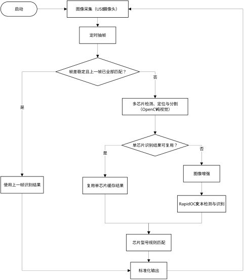
  

---
title: YOLO漏检展示
routeAlias: miss-detection
hideInToc: true
---

<!-- 右侧只固定图片宽度，不固定高度，是为了保留原图比例并避免上下贴边。 -->

  

    

      
补充图示

      <h1 class="mt-7 text-[54px] leading-tight font-semibold text-slate-900">YOLO漏检展示</h1>
    

    <button class="mb-4 w-fit border border-slate-300 px-6 py-3 text-[22px] text-slate-700 hover:bg-slate-50" @click="$nav.go(4)">返回</button>
  

  

    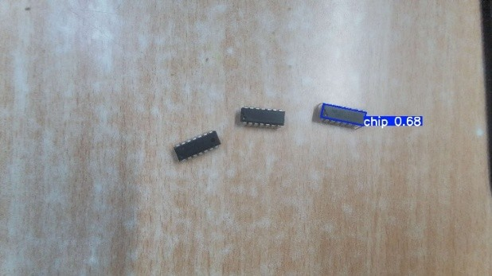
    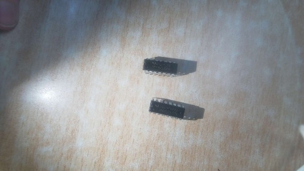
  

---
title: 帧差计算流程图
routeAlias: frame-diff
hideInToc: true
---

  

    

      
补充图示

      <h1 class="mt-7 text-[54px] leading-tight font-semibold text-slate-900">帧差计算</h1>
    

    <button class="mb-4 w-fit border border-slate-300 px-6 py-3 text-[22px] text-slate-700 hover:bg-slate-50" @click="$nav.go(7)">返回</button>
  

  

    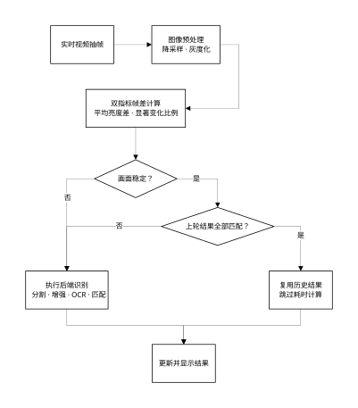
  

---
title: 分割流程图
routeAlias: segmentation
hideInToc: true
---

  

    

      
补充图示

      <h1 class="mt-7 text-[54px] leading-tight font-semibold text-slate-900">多芯片分割</h1>
    

    <button class="mb-4 w-fit border border-slate-300 px-6 py-3 text-[22px] text-slate-700 hover:bg-slate-50" @click="$nav.go(8)">返回</button>
  

  

    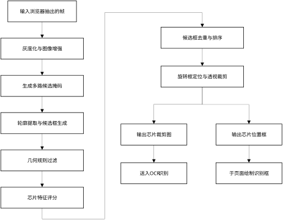
  

---
title: 预处理流程图
routeAlias: pre-processing
hideInToc: true
---

  

    

      
补充图示

      <h1 class="mt-7 text-[54px] leading-tight font-semibold text-slate-900">OCR预处理</h1>
    

    <button class="mb-4 w-fit border border-slate-300 px-6 py-3 text-[22px] text-slate-700 hover:bg-slate-50" @click="$nav.go(9)">返回</button>
  

  

    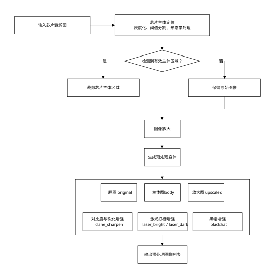
  

---
title: 识别结果示例
routeAlias: results-page-example
hideInToc: true
---

补充图示

  <h1 class="text-[40px] leading-tight font-semibold text-slate-900">识别结果示例</h1>
  <button class="mt-2 shrink-0 border border-slate-300 bg-white/70 px-5 py-2.5 text-[17px] font-medium text-slate-700 hover:bg-slate-50" @click="$nav.go(11)">返回</button>

<!-- 示例图页固定图片区高度，是为了让高分辨率截图完整缩放进 16:9 画布，而不是按原始像素溢出页面。 -->

  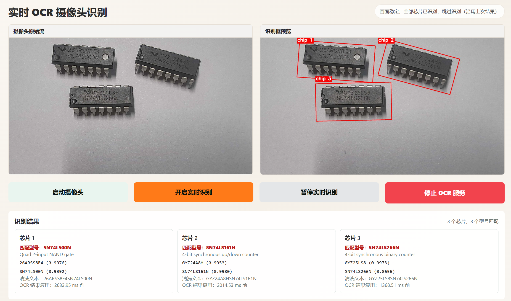

